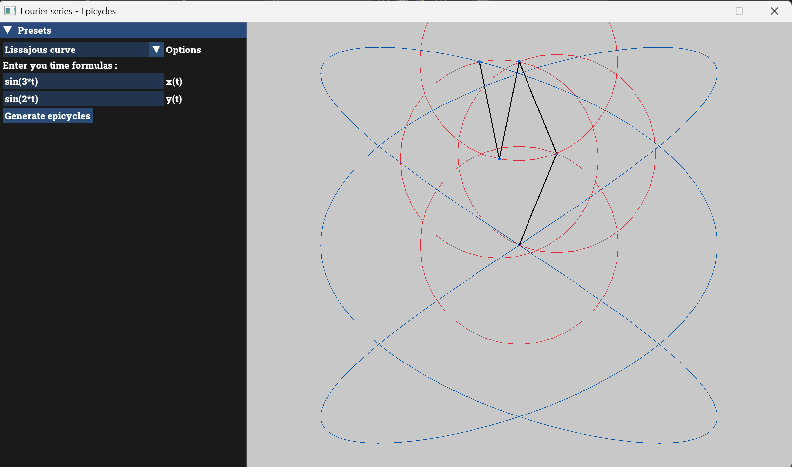

# 🌀 Fourier Series Epicycles Visualizer

An interactive Fourier series visualizer written in C++. This program lets you input complex parametric mathematical equations in real-time and draw them on screen using the Discrete Fourier Transform (DFT) and the epicycles principle (nested circles).



## ✨ Features

*   **Real-time Mathematical Parser:** Enter any parametric formula for x(t) and y(t) directly in the interface (e.g., `16 * sin(t)^3`, exponentials, trigonometry, etc.).
*   **DFT Calculation:** The program samples the curve and automatically calculates the frequencies, radii, and phases needed to reproduce the drawing.
*   **Auto-scaling:** The drawing dynamically adapts to the window size, regardless of the mathematical values entered.
*   **Built-in Presets:** Pre-recorded shapes (Circle, Heart, Star, Lissajous) to quickly test the rendering engine.

## 🛠️ Technologies Used

*   **[C++](https://isocpp.org/)**: Main programming language.
*   **[Raylib](https://www.raylib.com/)**: 2D graphics rendering engine to draw the epicycles and the path efficiently.
*   **[ImGui](https://github.com/ocornut/imgui)** & **[rlImGui](https://github.com/raysan5/rlImGui)**: Graphical User Interface (GUI) integrated on top of Raylib.
*   **[ExprTk](https://github.com/ArashPartow/exprtk)**: Ultra-fast mathematical parser to evaluate user's string equations.
*   **[CMake](https://cmake.org/)**: Project configuration and build tool.

## 🚀 Installation & Compilation

Make sure you have a C++ compiler and CMake installed on your machine.

1. Clone this repository:
   ```bash
   git clone https://github.com/SoleilNoir06/fourier-series.git
   cd fourier-series

2. Create a build directory and configure the project
    ```bash
    mkdir build
    cd build
    cmake ..

3. Build the project
    ```bash
    cmake --build .

## 👨‍💻 About

Project developed as a personal exploration of C++ software architecture and applied mathematics, before starting a Bachelor's degree in Software Engineering at HE-Arc in Neuchâtel, Switzerland.